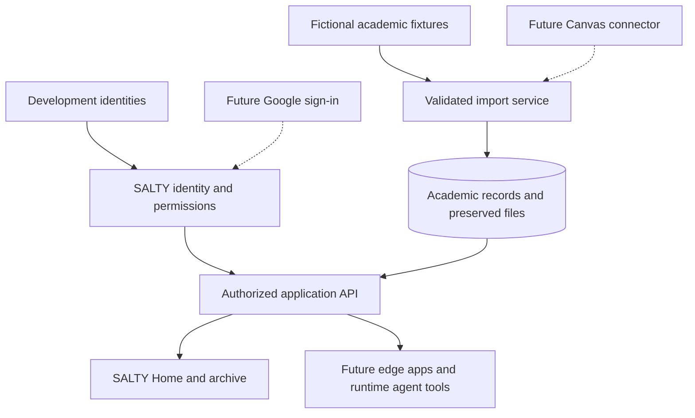

# SALTY architecture

Status: proposed foundation; implementation pending.

## System boundaries

## Shared core

Use permanent internal IDs for people. Link external accounts by provider, provider instance, and external subject ID, with a verified mapping. Email is an attribute, not a permanent key. Support multiple roles and contextual relationships: a teacher’s access depends on the relevant section or other approved relationship.

Initial entities: Person, ExternalIdentity, RoleAssignment, AcademicTerm, Course, Section, Enrollment, Assignment, Submission, Feedback, FileAsset, ImportRun, and AuditEvent. Grades and feedback belong to the relevant student submission or enrollment, not to a globally visible course object.

Design later household, guardian, applicant, and alumni records around the same person identity. A school email account must not be required for a historical record to exist.

## Academic ingestion

A sample-data adapter and eventual live connectors feed the same validation and import boundary. Preserve provider instance, external ID, person/section relationships, source timestamps, import timestamps, and provenance. Scope source identifiers by provider instance and entity type.

Imports must be repeatable without duplicates, track failures, and distinguish a failed fetch from a deleted record. Preserve meaningful revisions and define handling of source corrections and deletions before live use. Record completeness and unsupported items; never label a partial import complete.

Store actual authorized file content with checksums and metadata. Access checks apply to file downloads as well as record APIs. Links to external files alone do not constitute an archive.

Historical retention is governed by school-approved policies, including correction and deletion processes. “Persistent” does not mean indiscriminate permanent retention of every source item.

## Applications and agents

Start with one modular backend and application. Edge apps consume stable, documented APIs and shared identity. They must not invent independent school identities or receive unrestricted database credentials.

Authenticate and authorize every operation, deriving the caller from the session. Do not trust a student ID supplied by a client or model as authority. Runtime agent tools are scoped API clients; model-generated interpretations remain distinguishable from official records.

The Forge is the contributor tooling and release process. GitHub controls source contributions; SALTY controls school-data access. Development and preview environments use fictional data and separate secrets from production.

## Ownership during transition

| Record or function | Initial owner |
| --- | --- |
| School authentication | Google, when connected |
| SALTY identities, app permissions | SALTY |
| Current coursework and grading | Canvas until approved cutover |
| Preserved imported history | SALTY archive with source provenance |
| Official enrollment and SIS records | Blackbaud until approved cutover |

Each migration requires requirements coverage, reconciliation, an explicit ownership switch, and a recovery plan. Avoid competing writers to the same official record.

## Stack selection

No application stack is selected yet. Proposed shape: a modular web application, relational database, file storage, and a background import worker. M1-01 records the selected tools and tradeoffs, then supplies a reproducible setup. Evaluate existing project compatibility, contributor setup, maintainability, deployment, and access enforcement.
